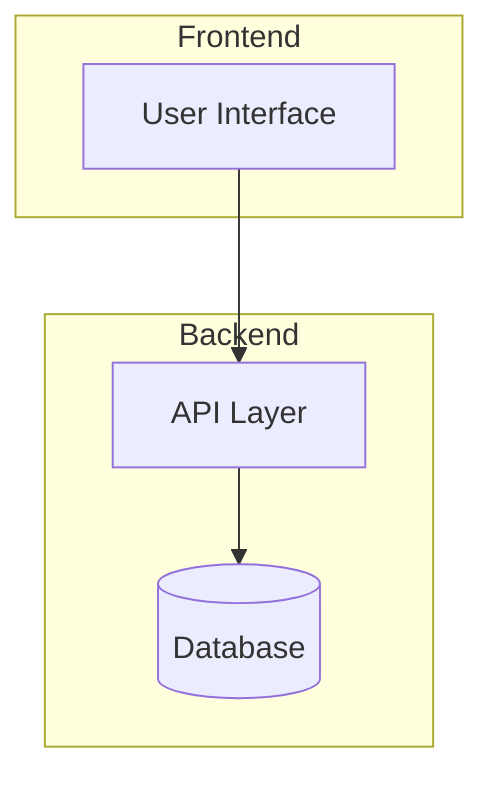
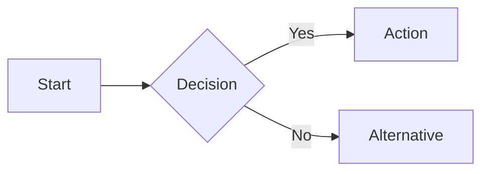

# PRD Interview Skill

Guide comprehensive interviews to transform rough ideas into actionable Product Requirements Documents through structured discovery across 8 categories.

## Core Interview Process

### Interview Flow

1. **Initial Prompt**: Capture the base idea in user's own words
2. **Category-Based Discovery**: Work through relevant categories using AskUserQuestion
3. **Adaptive Branching**: Skip irrelevant questions based on context
4. **Progressive Summarization**: Summarize after each category before moving on
5. **Document Generation**: Create the final PRD with Mermaid diagrams
6. **Task Integration**: Offer to generate hierarchical tasks via taskmanager

### Interview Categories

Conduct interviews across these 8 categories (adapt based on PRD type):

| Category | Focus Areas | When to Use |
|----------|-------------|-------------|
| Problem & Context | Pain points, current state, why now | Always |
| Users & Customers | Personas, segments, user journeys | Always |
| Solution & Features | Feature list, MVP scope, priorities | Always |
| Technical Implementation | Architecture, stack, integrations | Always |
| Business & Value | ROI, pricing, revenue model | Products, major features |
| UX & Design | Flows, wireframes, accessibility | UI-facing work |
| Risks & Concerns | Dependencies, assumptions, blockers | Always |
| Testing & Quality | Test strategies, acceptance criteria | Always |

### Question Guidelines

When using AskUserQuestion:
- Ask 2-4 questions per round maximum
- Provide concrete options when possible
- Enable multiSelect for non-mutually-exclusive choices
- Include "Other" automatically (tool handles this)
- Use short headers (max 12 chars)

### Adaptive Branching Rules

Skip categories based on context:
- **Internal tool**: Skip pricing/revenue questions in Business & Value
- **Backend-only**: Minimize UX & Design category
- **Bug fix**: Focus on Problem & Context, Technical, Testing
- **Feature**: Full interview but lighter on Business & Value

## Session State Management

### State File Location

Save interview progress to: `.taskmanager/prd-state.json`

### State Structure

```json
{
  "sessionId": "uuid",
  "prdType": "product|feature|bugfix",
  "slug": "feature-name",
  "startedAt": "ISO timestamp",
  "lastUpdatedAt": "ISO timestamp",
  "currentCategory": "category-name",
  "completedCategories": ["category1", "category2"],
  "answers": {
    "category-name": {
      "question-key": "answer-value"
    }
  },
  "initialPrompt": "User's original description"
}
```

### Resuming Sessions

When `/prd` or similar is invoked:
1. Check for existing state in `.taskmanager/prd-state.json`
2. If found, ask user: "Resume previous session for '{slug}' or start fresh?"
3. If resuming, continue from `currentCategory`
4. If starting fresh, archive old state and begin new session

## PRD Document Structure

### Output Location

Save PRDs to: `docs/prd/prd-{slug}.md`

### Document Template

Generate PRDs following the template in `templates/prd-template.md`. Key sections:

1. **Header**: Title, version, date, status, author
2. **Executive Summary**: One-paragraph overview
3. **Problem Statement**: What problem, who has it, current solutions
4. **Users & Personas**: Target users with characteristics
5. **Solution Overview**: High-level approach
6. **Features & Requirements**: Detailed feature breakdown with priorities
7. **Technical Architecture**: Stack, integrations, Mermaid diagrams
8. **User Experience**: Flows, wireframes references
9. **Business Case**: Value proposition, pricing (if applicable)
10. **Risks & Mitigations**: Known risks with mitigation strategies
11. **Testing Strategy**: Acceptance criteria, test approach
12. **Timeline & Milestones**: Phase breakdown (if applicable)
13. **Open Questions**: Unresolved items for follow-up

### Mermaid Diagrams

Include these diagrams where appropriate:

**Architecture Diagram**:


**User Flow Diagram**:


## TaskManager Integration

### Task Generation Process

After PRD completion:
1. Parse all features from the PRD
2. Create hierarchical task structure:
   - Parent task per major feature
   - Child tasks for implementation steps
3. Use `/taskmanager:plan` with the PRD file path

### Task Hierarchy Example

```
Feature: User Authentication
├── Setup authentication infrastructure
├── Implement login endpoint
├── Implement registration endpoint
├── Add password reset flow
├── Create authentication middleware
└── Write authentication tests
```

### Automatic Execution

After generating tasks, ask: "Tasks created. Start autonomous execution?"
If yes, invoke `/taskmanager:run-tasks` to begin implementation.

## PRD Types

### Full Product PRD (`/prd`)

Complete interview covering all 8 categories in depth:
- 10-15 question rounds
- Comprehensive documentation
- Full Mermaid diagrams
- Complete task breakdown

### Feature PRD (`/prd:feature`)

Lighter interview focused on implementation:
- 5-8 question rounds
- Skip or minimize Business & Value (unless monetized feature)
- Focus on Technical, UX, Testing
- Assume product context exists

### Bug Fix PRD (`/prd:bugfix`)

Problem-focused documentation:
- 3-5 question rounds
- Heavy focus on Problem & Context
- Technical root cause analysis
- Regression testing strategy
- Skip Business, minimize UX

### Refine PRD (`/prd:refine`)

Enhance existing PRDs:
1. Read and analyze existing PRD
2. Identify weak or missing sections
3. Ask targeted questions for gaps only
4. Merge new answers into existing document
5. Preserve original content where adequate

## Additional Resources

### Reference Files

Detailed question banks for each category:
- **`references/question-bank.md`** - Complete question library organized by category

### Template Files

PRD output template:
- **`templates/prd-template.md`** - Full PRD document structure
