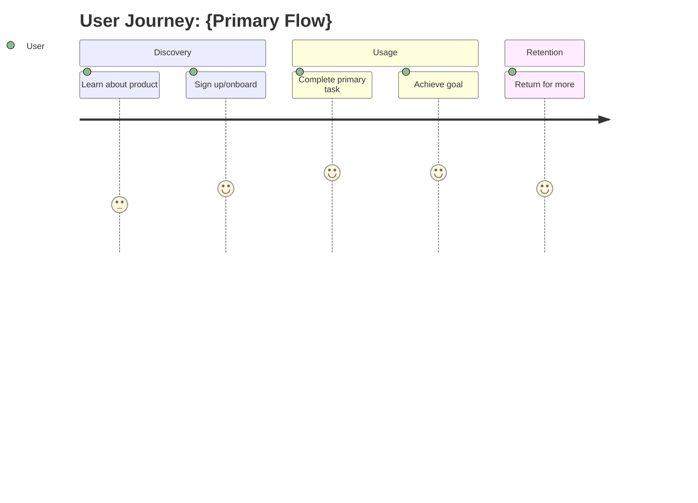
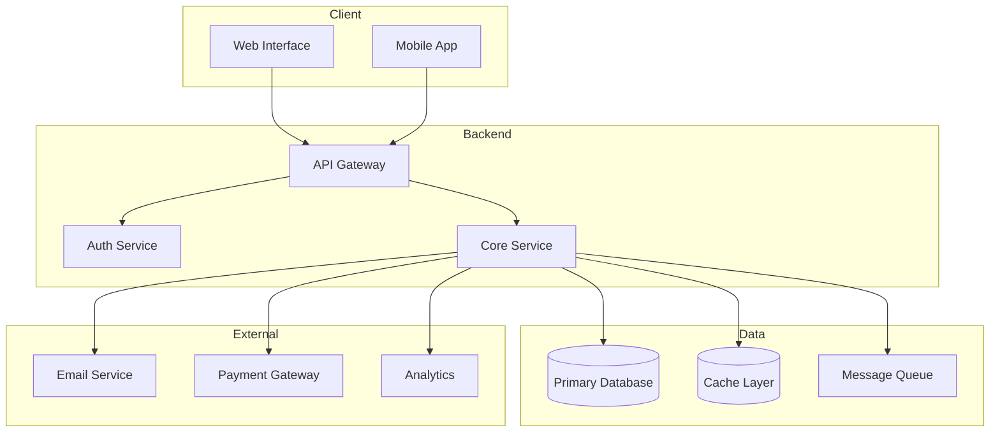
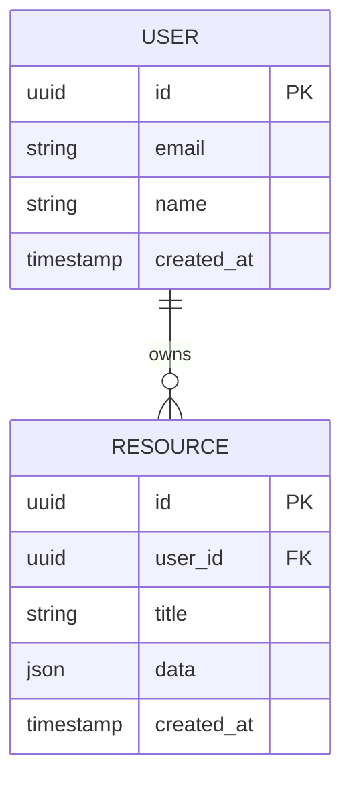
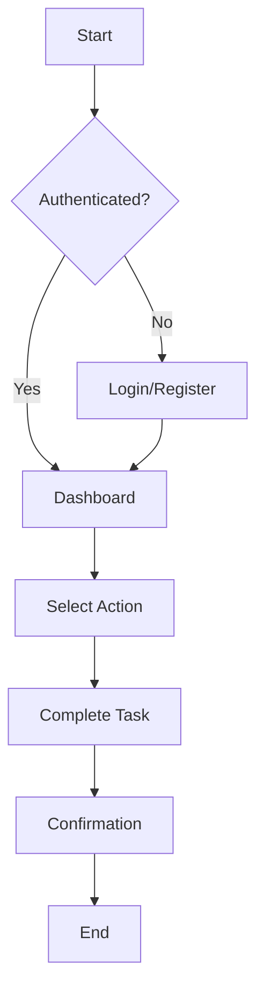
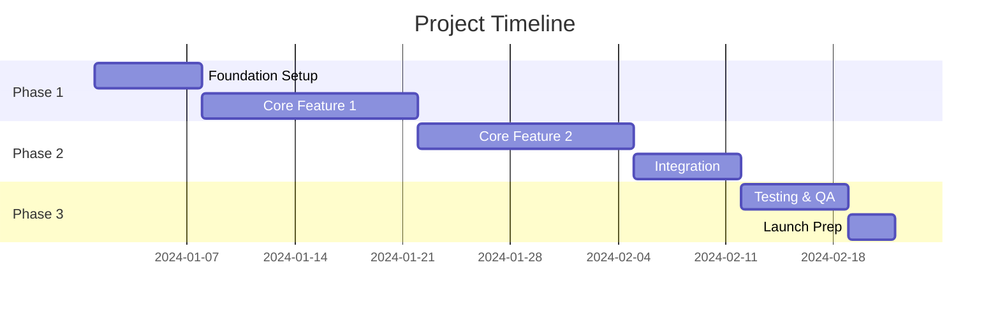

# {PROJECT_TITLE}

> **Version**: 1.0.0
> **Status**: Draft | In Review | Approved
> **Created**: {DATE}
> **Last Updated**: {DATE}
> **Author**: {AUTHOR}

---

## Executive Summary

{One paragraph summarizing the product/feature: what it is, who it's for, and why it matters.}

---

## 1. Problem Statement

### The Problem

{Clear description of the problem being solved.}

### Who Has This Problem

{Description of who experiences this problem and how often.}

### Current Solutions & Workarounds

{How users currently handle this problem, and why existing solutions are inadequate.}

### Why Now

{Why this is the right time to solve this problem.}

---

## 2. Users & Personas

### Primary User: {Persona Name}

| Attribute | Description |
|-----------|-------------|
| Role | {Job title or user type} |
| Technical Level | {Non-technical / Basic / Power User / Technical} |
| Primary Goal | {What they want to accomplish} |
| Pain Points | {Their main frustrations} |
| Success Criteria | {How they measure success} |

### Secondary Users

{List any secondary user types and their key characteristics.}

### User Journey

---

## 3. Solution Overview

### High-Level Approach

{Description of the proposed solution at a high level.}

### Key Differentiators

{What makes this solution unique or better than alternatives.}

### Success Metrics

| Metric | Target | Measurement Method |
|--------|--------|-------------------|
| {Metric 1} | {Target value} | {How measured} |
| {Metric 2} | {Target value} | {How measured} |

---

## 4. Features & Requirements

### MVP Features (P0 - Must Have)

#### Feature 1: {Feature Name}

**Description**: {What this feature does}

**User Story**: As a {user type}, I want to {action} so that {benefit}.

**Acceptance Criteria**:
- [ ] {Criterion 1}
- [ ] {Criterion 2}
- [ ] {Criterion 3}

**Technical Notes**: {Any implementation considerations}

---

#### Feature 2: {Feature Name}

**Description**: {What this feature does}

**User Story**: As a {user type}, I want to {action} so that {benefit}.

**Acceptance Criteria**:
- [ ] {Criterion 1}
- [ ] {Criterion 2}

---

### Post-MVP Features (P1 - Should Have)

| Feature | Description | Estimated Effort |
|---------|-------------|------------------|
| {Feature} | {Brief description} | {S/M/L/XL} |

### Future Considerations (P2 - Nice to Have)

| Feature | Description | Notes |
|---------|-------------|-------|
| {Feature} | {Brief description} | {Why deferred} |

### Explicitly Out of Scope

- {Item 1}
- {Item 2}

---

## 5. Technical Architecture

### System Overview

### Technology Stack

| Layer | Technology | Rationale |
|-------|------------|-----------|
| Frontend | {Technology} | {Why chosen} |
| Backend | {Technology} | {Why chosen} |
| Database | {Technology} | {Why chosen} |
| Infrastructure | {Technology} | {Why chosen} |

### Key Technical Decisions

| Decision | Choice | Alternatives Considered | Rationale |
|----------|--------|------------------------|-----------|
| {Decision} | {Choice} | {Alternatives} | {Why} |

### Integrations

| Integration | Purpose | API/Method |
|-------------|---------|------------|
| {Service} | {What it does} | {REST/GraphQL/SDK} |

### Data Model

---

## 6. User Experience

### Key User Flows

#### Flow 1: {Primary Flow Name}

### Wireframe References

{Links to wireframes or descriptions of key screens}

| Screen | Description | Key Elements |
|--------|-------------|--------------|
| {Screen 1} | {Purpose} | {Key UI elements} |
| {Screen 2} | {Purpose} | {Key UI elements} |

### Accessibility Requirements

- [ ] WCAG 2.1 AA compliance
- [ ] Keyboard navigation support
- [ ] Screen reader compatibility
- [ ] Color contrast requirements met
- [ ] {Additional requirements}

### Responsive Design

| Breakpoint | Behavior |
|------------|----------|
| Mobile (<768px) | {Description} |
| Tablet (768-1024px) | {Description} |
| Desktop (>1024px) | {Description} |

---

## 7. Business Case

### Value Proposition

{Clear statement of value delivered to users/business.}

### Revenue Model

{How this generates or saves money - skip for internal tools.}

| Revenue Stream | Description | Projected Impact |
|----------------|-------------|------------------|
| {Stream} | {How it works} | {Expected outcome} |

### Pricing Strategy

{Pricing tiers and rationale - skip for internal tools.}

| Tier | Price | Features |
|------|-------|----------|
| {Tier} | {Price} | {Included features} |

### ROI Analysis

| Investment | Expected Return | Timeframe |
|------------|-----------------|-----------|
| {Cost area} | {Expected benefit} | {When realized} |

---

## 8. Risks & Mitigations

### Technical Risks

| Risk | Probability | Impact | Mitigation |
|------|-------------|--------|------------|
| {Risk} | High/Medium/Low | High/Medium/Low | {Mitigation strategy} |

### Business Risks

| Risk | Probability | Impact | Mitigation |
|------|-------------|--------|------------|
| {Risk} | High/Medium/Low | High/Medium/Low | {Mitigation strategy} |

### Dependencies

| Dependency | Owner | Status | Risk if Delayed |
|------------|-------|--------|-----------------|
| {Dependency} | {Team/Person} | {Status} | {Impact} |

### Assumptions

- {Assumption 1}
- {Assumption 2}
- {Assumption 3}

---

## 9. Testing Strategy

### Testing Approach

| Test Type | Scope | Tools |
|-----------|-------|-------|
| Unit Tests | {Coverage target} | {Pest/PHPUnit} |
| Integration Tests | {What's covered} | {Tools} |
| E2E Tests | {Key flows} | {Playwright} |
| Performance Tests | {Benchmarks} | {Tools} |

### Acceptance Criteria by Feature

{Reference to feature acceptance criteria above, or detailed test cases.}

### Edge Cases & Error Scenarios

| Scenario | Expected Behavior | Test Approach |
|----------|-------------------|---------------|
| {Edge case} | {What should happen} | {How to test} |

### Performance Requirements

| Metric | Target | Measurement |
|--------|--------|-------------|
| Page Load Time | {Target} | {How measured} |
| API Response Time | {Target} | {How measured} |
| Concurrent Users | {Target} | {How tested} |

### Security Testing

- [ ] OWASP Top 10 review
- [ ] Dependency vulnerability scan
- [ ] Authentication/authorization testing
- [ ] Data encryption verification
- [ ] {Additional security tests}

---

## 10. Timeline & Milestones

### Phase Overview

### Milestones

| Milestone | Description | Target Date |
|-----------|-------------|-------------|
| M1: {Name} | {What's delivered} | {Date} |
| M2: {Name} | {What's delivered} | {Date} |
| M3: {Name} | {What's delivered} | {Date} |

---

## 11. Open Questions

| # | Question | Owner | Due Date | Status |
|---|----------|-------|----------|--------|
| 1 | {Question} | {Who answers} | {When needed} | Open/Resolved |
| 2 | {Question} | {Who answers} | {When needed} | Open/Resolved |

---

## Appendix

### Glossary

| Term | Definition |
|------|------------|
| {Term} | {Definition} |

### References

- {Link to related document}
- {Link to research}
- {Link to design files}

### Change Log

| Version | Date | Author | Changes |
|---------|------|--------|---------|
| 1.0.0 | {Date} | {Author} | Initial draft |
